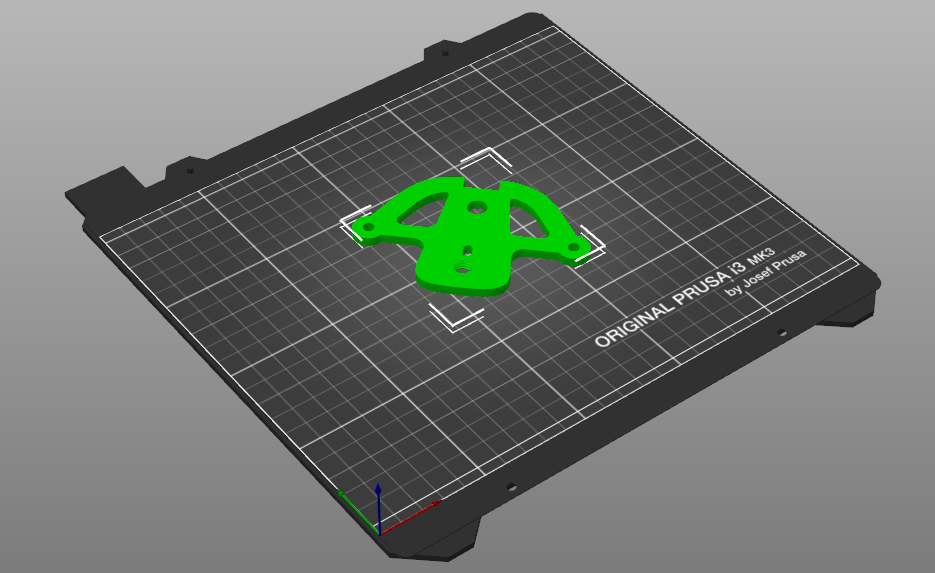

# 3D Print Settings
---------------

## Summary
The primary purpose of 3D printing the part was simply just to checonfirm modelled part dimensions against the original broken part before having the replacement made by a metal fabricator.

The OEM tiller plate part is made from anodised 6061 Aluminium.  As such, any 3D printed part will never be as strong.  Nevertheless, I optimised the 3D print settings and filament choice to give the strongest 3D part possible.

## Filament
PETG filament was used which should provide some stength improvements over PLA.

## Slicer Settings
The model was sliced with PrusaSliver V2.5 and the following settings were changed to optimised the part stength.

**Print Setting Changes to Prusament PETG profile:**
|Parameter|Setting|default|value used|
|---|---|---|---|
|Vertical Shells|Number perimeters|3|6|
|Horizontal Shells|Solid Layers - Top & Bottom|3|6|
|Infill|Fill density|20%|60%|
|Infill|Fill patter|cubic|gyroid|

## Orientation
Part was rotated 45 degrees on platter in an attempt to minimise stresses along weaker layer orientation planes 

