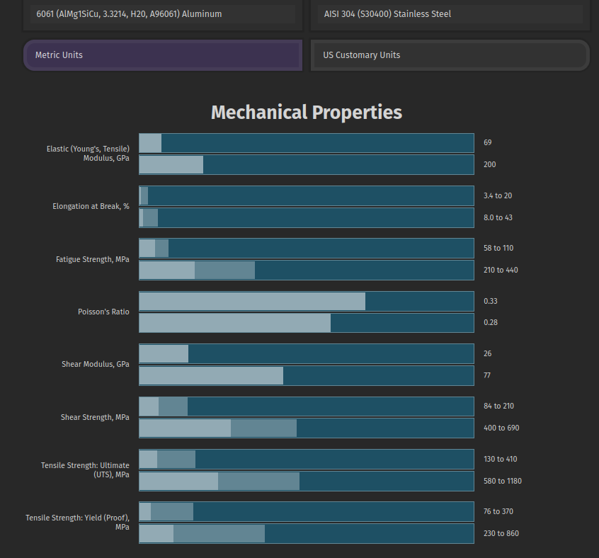

# tillerPlate
-----
FreeCAD model of replacement SmartTrack kayak rudder tiller plate suitable to be water jet cut from stainless steel plate

## Introduction
A buddy of mine has a sea kayak outfitted with a USA-made [Smart Track™ rudder control system](http://www.smart-tracker.com/index.htm) where the aluminium tiller plate has recently broken due to an apparent shear failure.  As he has not been able to source a replacement tiller plate in Australia, I drew up a replacement part in FreeCad and 3D printed a replacement part, mainly to confirm the model.  

## Fabrication

The OEM tiller plate appears to be made of anodised 6061 aluminium.   Although I did all I could to strengthen the 3D printed part used to confirm the model dimensions, clearly a plastic PETG part will be significantly weaker than the OEM part out of 6061 aluminium.

As such, I have provided a drawing file and digital dxf fabrication file that can be given to a metal fabricator to have the part custom water jet or laser cut from a strong, corrosion resistant material such as AISA 304 (marine grade) stainless steel plate.  

Below is a comparison of the material properties of 6061 Aluminium (top bar on bar chart) vs 304 Stainless steel (lower bar on chart).  Clearly 304 stainless steel is much stronger than the OEM prt and less likely to fail again.

### Repository Contents

#### 3D Printing ####
Contains mesh (.stl) file as well as a *.3mf file that has both mesh and slicer settings.  The 3D print setting summary file gives an overview of changes made to optimise the PETG print strength.

#### Dimensions
Contains the few (and incomplete) dimensional drawings that I could find online for the OEM tiller plate

#### Fabrication
This directory contains everything you need to have the part cut out by a metal fabricator: 
*  annotated drawing file,  
*  DXF file containing digital 2D vector cut instructions for water jet or laser cutting, and
*  fabrication instructions.  

Google metal fabricators near you and upload or email these three files to a few fabricators to obtain quotes.

#### FreeCAD models
CAD models made using FreeCAD version 20.2:  the model with threads is intended for 3D printing while the model without threads is for metal fabrication where the threads should be tapped after the part is cut and (tap) holes drilled.

Model was created by importing in a photo image of broken tiller plate and using micrometers to confirm dimensions.  Once, modelled, I 3D printed the part (PETG) so that I could compare it to the broken OEM part and confirm the tiller plate dimensions were correct.

#### Images
Various images of the broken tiller plate, unbroken plate and 3D printed part.

 

### Licence

[![CC BY 4.0][cc-by-shield]][cc-by]

This work is licensed under a
[Creative Commons Attribution 4.0 International License][cc-by].

[![CC BY 4.0][cc-by-image]][cc-by]

[cc-by]: http://creativecommons.org/licenses/by/4.0/
[cc-by-image]: https://i.creativecommons.org/l/by/4.0/88x31.png
[cc-by-shield]: https://img.shields.io/badge/License-CC%20BY%204.0-lightgrey.svg
