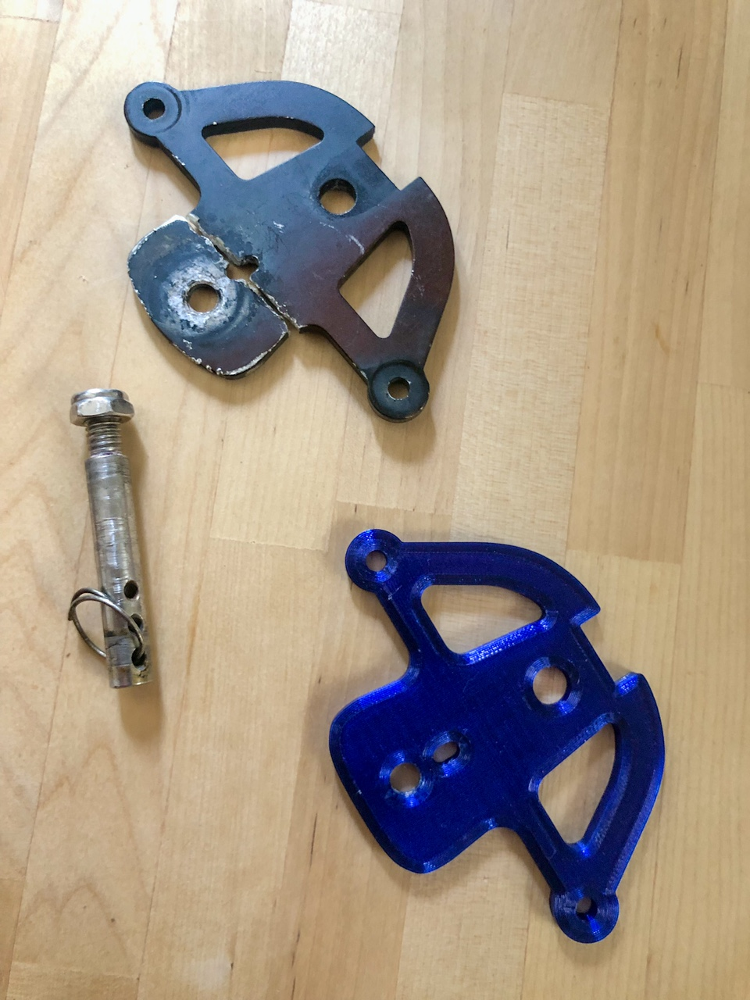

# tillerPlate
-----
FreeCAD model of replacement SmartTrack kayak rudder tiller plate suitable to be water jet cut from stainless steel plate

## Introduction
A buddy of mine has a sea kayak outfitted with a USA-made [Smart Track™ rudder control system](http://www.smart-tracker.com/index.htm) where the aluminium tiller plate has recently broken due to an apparent shear failure.  As he has not been able to source a replacement tiller plate in Australia, I drew up a replacement part in FreeCad and 3D printed a replacement part, mainly to confirm the model.  

The OEM tiller plate appears to be made of annodised 6061 aluminium.   Although I did all I could to strengthen the 3D printed part, clearly a plastic PETG part will be significantly weaker than the OEM part out of 6061 aluminium.

As such, I have provided a drawing file and digital dxf fabrication file that he can give to a metal fabricator to have the part custom water jet cut from a strong, corrosion resistant material such as AISA 304 (marine grade) stainless steel plate.

### Repository Contents

#### 3D Printing ####
Contains mesh (.stl) file as well as a *.3mf file that has both mesh and slicer settings.  The read.me file gives an overview of changes made to optimise the PETG print stength.

#### Dimensions
Contains the few dimensional drawings I could find for the tiller plate

#### Fabrication
Everything you need to have the part cut out by a metal fabricator, including drawings and DXF file containing digital 2D vector cut instructions for water jet or laser  cutting.  

#### FreeCAD models
CAD models made using FreeCAD version 20.2:  the model with threads is intended for 3D printing while the model without threads is for metal fabrication (the threads can be tapped after the part is cut)

#### Images
Various images of the broken tiller plate, unbroken plate and 3D printed part.

 

### Licence

[![CC BY 4.0][cc-by-shield]][cc-by]

This work is licensed under a
[Creative Commons Attribution 4.0 International License][cc-by].

[![CC BY 4.0][cc-by-image]][cc-by]

[cc-by]: http://creativecommons.org/licenses/by/4.0/
[cc-by-image]: https://i.creativecommons.org/l/by/4.0/88x31.png
[cc-by-shield]: https://img.shields.io/badge/License-CC%20BY%204.0-lightgrey.svg
